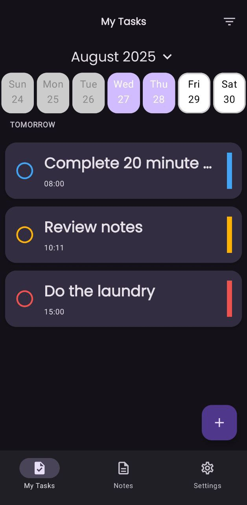
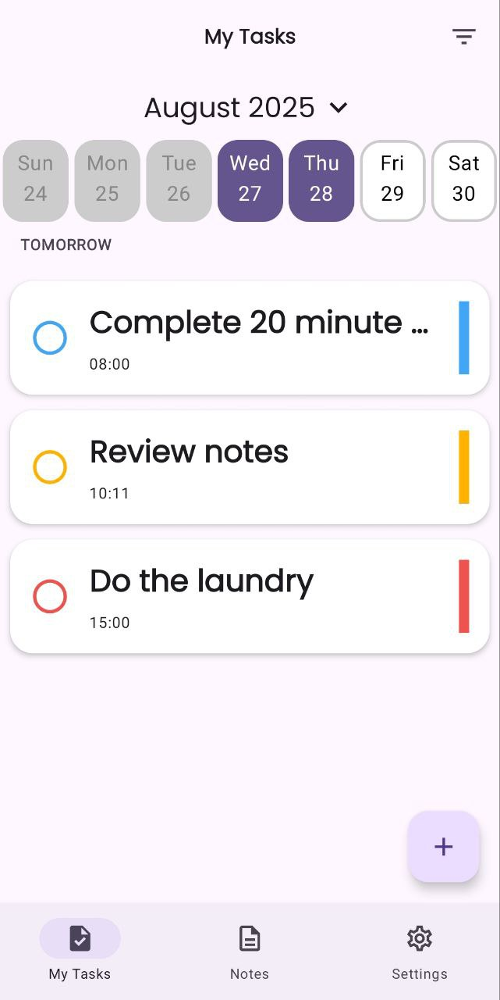
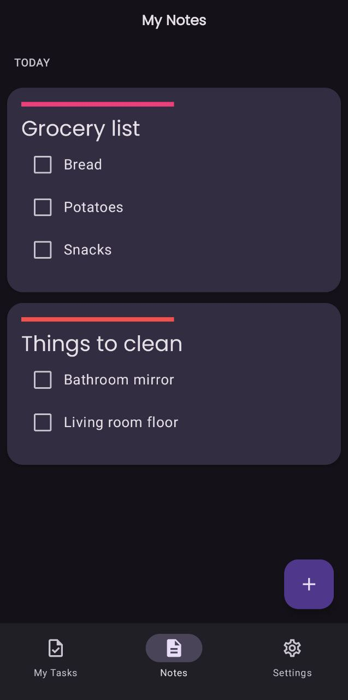
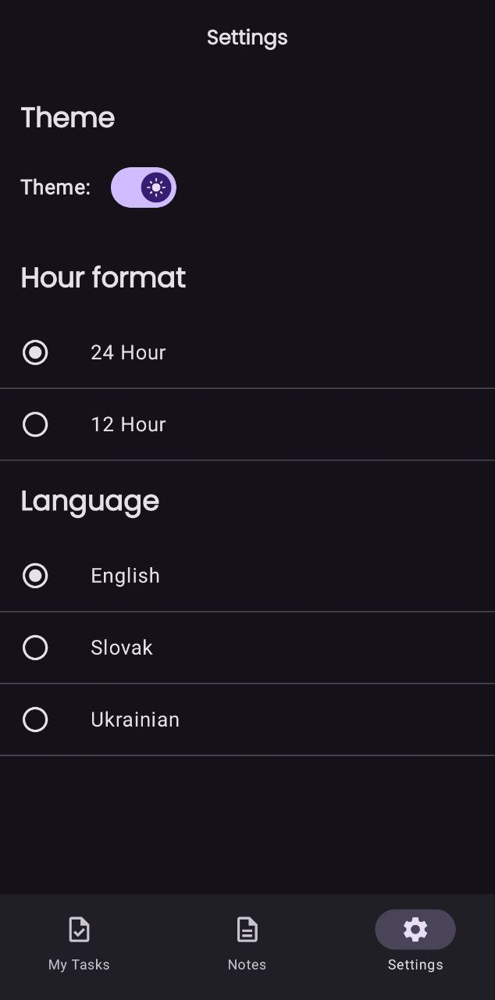

<h1>📌 Taskly</h1>

Taskly is a mobile app that helps you stay organized. 
With Taskly, you can:

<ul>
  <li>✅ Create and manage <strong>To-Dos</strong> with <strong> notifications</strong></li>
  <li>📝 Write <strong>Notes</strong></li>
  <li>🌙 Enjoy a <strong>Dark Theme</strong> for comfortable use at night</li>
  <li>🌍 Use the app in <strong>English</strong>, <strong>Slovak</strong>, or <strong>Ukrainian</strong></li>
</ul>

<h2>✨ Features</h2>
<ul>
  <li><strong>To-Do Management</strong> — create, edit, delete tasks with due dates.</li>
  <li><strong>Notifications</strong> — schedule notifications for tasks so you never miss deadlines.</li>
  <li><strong>Notes</strong> — quick, lightweight notes management.</li>
  <li><strong>Dark Theme</strong> — manual and automatic dark mode support.</li>
  <li><strong>Localization</strong> — English, Slovak, and Ukrainian translations included.</li>
</ul>

<h2>Screenshots</h2>

  
  
  
  

<h2>🛠 Tech Stack</h2>

<h3>Languages & Frameworks</h3>
<ul>
  <li>Kotlin 2.2.0</li>
  <li>Jetpack Compose (Material 3)</li>
  <li>Navigation Compose</li>
  <li>Koin for dependency injection</li>
  <li>Kotlinx Serialization</li>
</ul>

<h3>Architecture & Data</h3>
<ul>
  <li>MVI Architecture</li>
  <li>Room</li>
  <li>DataStore</li>
</ul>

<h3>UI Components & Utilities</h3>
<ul>
  <li>Material Icons Extended</li>
  <li>Kizitonwose Calendar</li>
  <li>KMP Date Time Picker</li>
  <li>Google Fonts in Compose</li>
  <li>SplashScreen API</li>
  <li>Timber</li>
</ul>

<h3>Firebase Services</h3>
<ul>
  <li>Firebase Analytics</li>
  <li>Firebase Crashlytics</li>
</ul>
